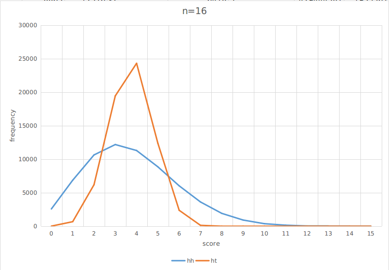
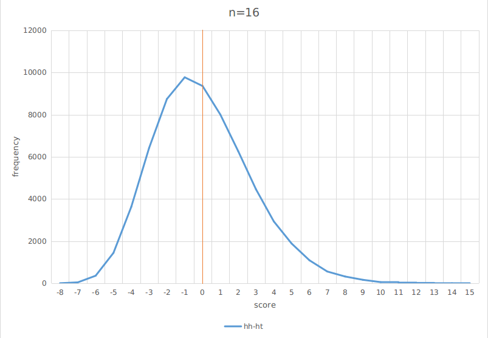
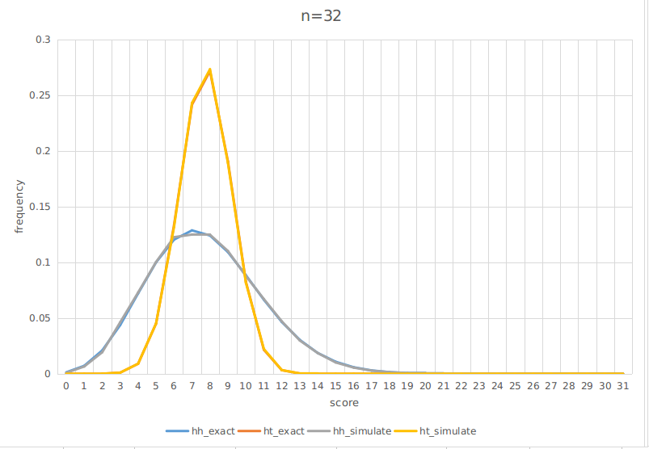
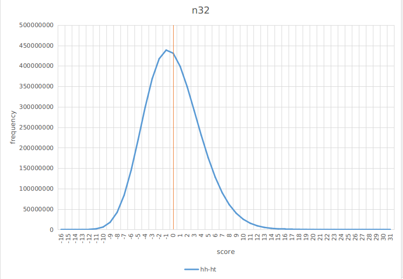
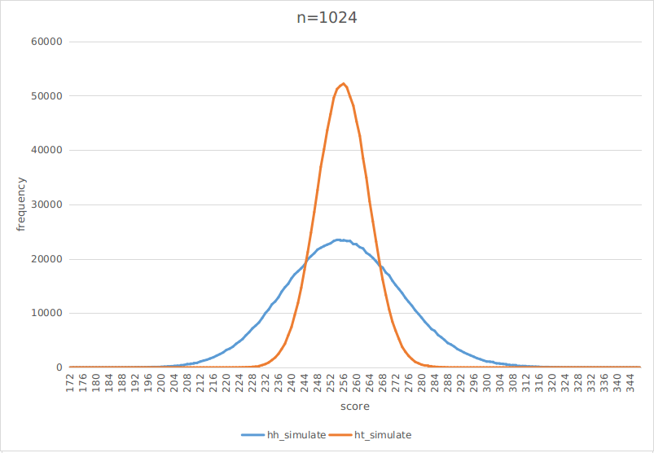

# Coin flip sequency probabilities

> Flip a fair coin 100 times—it gives a sequence of heads (H) and tails (T). For each HH in the sequence of flips, Alice gets a point; for each HT, Bob does, so e.g. for the sequence THHHT Alice gets 2 points and Bob gets 1 point. Who is most likely to win?

https://twitter.com/littmath/status/1769044719034647001

## Answer

Bob wins.

An intuitive explanation is that HH's distribution is more skewed due to the fact that HH's possible scores are much higher due to consecutive heads.
Thus, HH's distribution has more probability mass in the region `x < mean`.
Since HH and HT have the same mean, it follows that `HH < HT` happens more frequently.

This question highlights a few important aspects of probabilities:

### Mean of a distribution does not tell the full story of its shape

Let `n` be the sequence length, the mean of Alice's and Bob's distributions are the same `(n-1)/4`.
However, as shown below, the distribution of HH is much more skewed than HT, resulting in the difference between them to be skewed, too.

### Summation of random variables follow the central limit theorem

The below diagrams show the case where `n=32`.
Moreover, the sampling results match pretty well with the exact ones:

Since we confirmed that simulation gives correct results, we use it to calculate the case where `n=1024`

The below table summaries the winning probabilities of Alice and Bob for different sequence lengths.

|          | 16    | 32    | 1024  |
| -------- | ----- | ----- | ----- |
| hh <  ht | 0.464 | 0.475 | 0.495 |
| hh == ht | 0.143 | 0.100 | 0.018 |
| hh >  ht | 0.393 | 0.425 | 0.487 |
